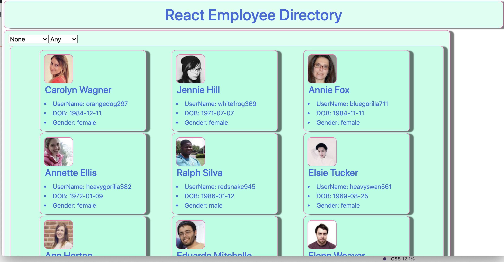
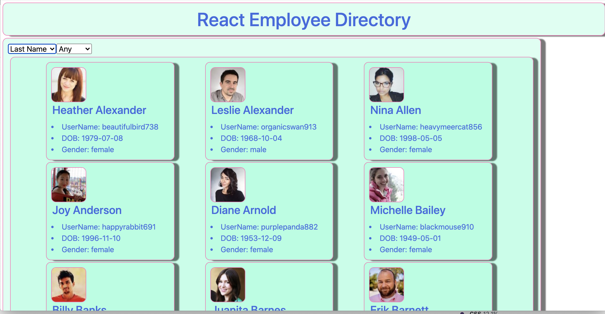
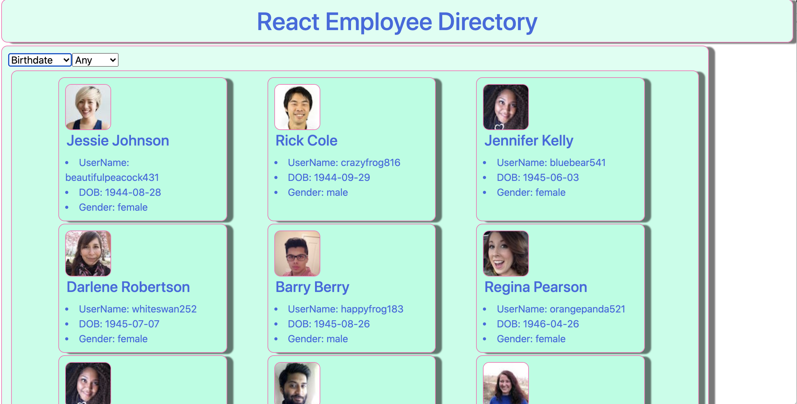
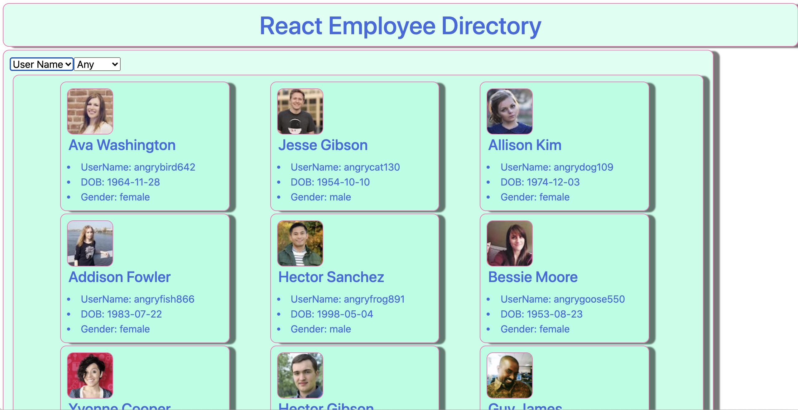
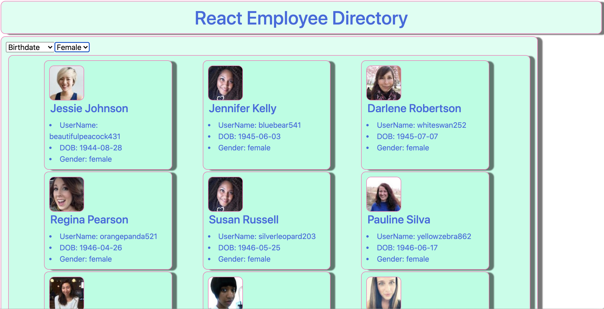

# React-Directory

## Description

A tool to sort and filter employees using react
## Table of Contents
- [Usage](#usage)
- [Languages](#languages)
- [Questions](#questions)

## Usage

Use it to sort empolyees ordering by last name:
 
age: 
user name:  
or filter by gender: 

## Languages

React, Javascript, HTML, CSS

## Repository
- https://github.com/PeteLow-13/React-Directory
## Questions

Contact me via email or github with questions
- pedritolow@gmail.com
- [PeteLow-13](http://github.com/PeteLow-13)
