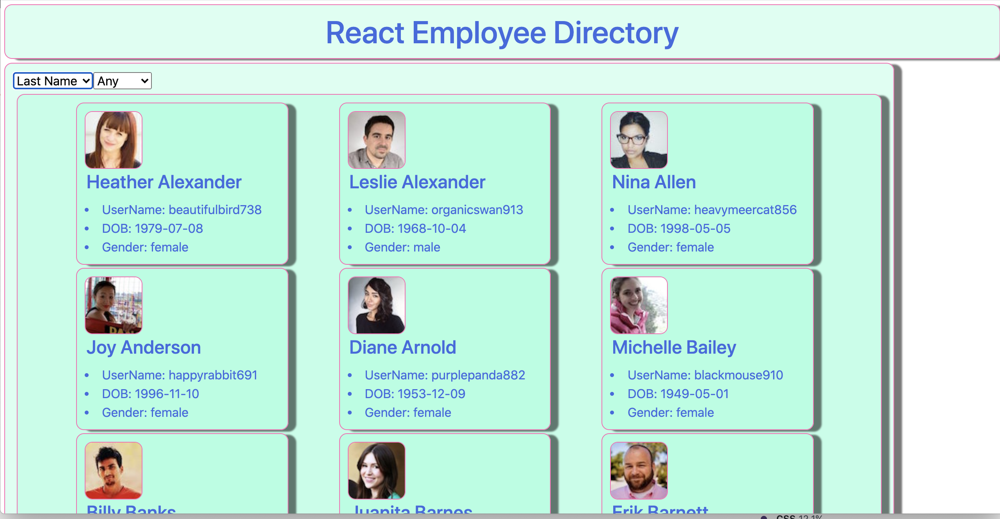
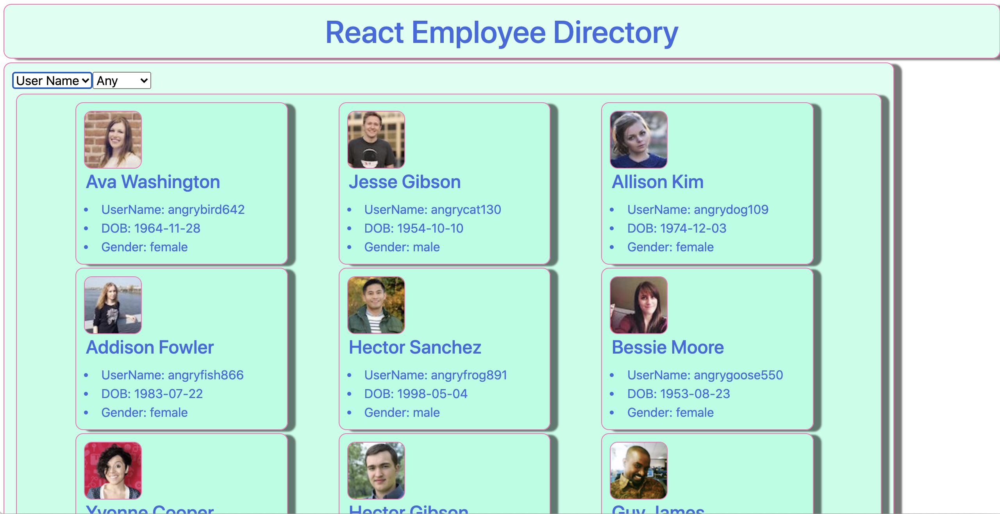
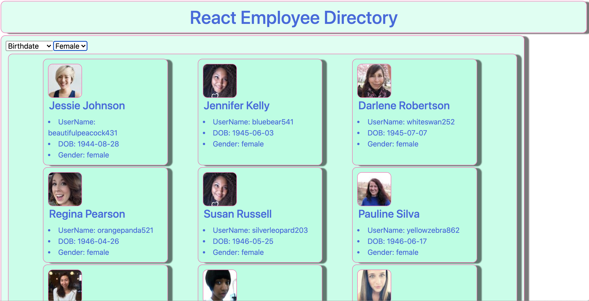

# Getting Started with Create React App

This project was bootstrapped with [Create React App](https://github.com/facebook/create-react-app).

## Available Scripts

In the project directory, you can run:

### `npm start`

Runs the app in the development mode.\
Open [http://localhost:3000](http://localhost:3000) to view it in the browser.

The page will reload if you make edits.\
You will also see any lint errors in the console.

### `npm test`

Launches the test runner in the interactive watch mode.\
See the section about [running tests](https://facebook.github.io/create-react-app/docs/running-tests) for more information.

# React-Directory

## Description

A tool to sort and filter employees using react
## Table of Contents
- [Usage](#usage)
- [Languages](#languages)
- [Questions](#questions)

## Usage

Use it to sort empolyees ordering by last name:
 
age: 
user name:  
or filter by gender: 

## Languages

React, Javascript, HTML, CSS

## Repository
- https://github.com/PeteLow-13/React-Directory
## Questions

Contact me via email or github with questions
- pedritolow@gmail.com
- [PeteLow-13](http://github.com/PeteLow-13)